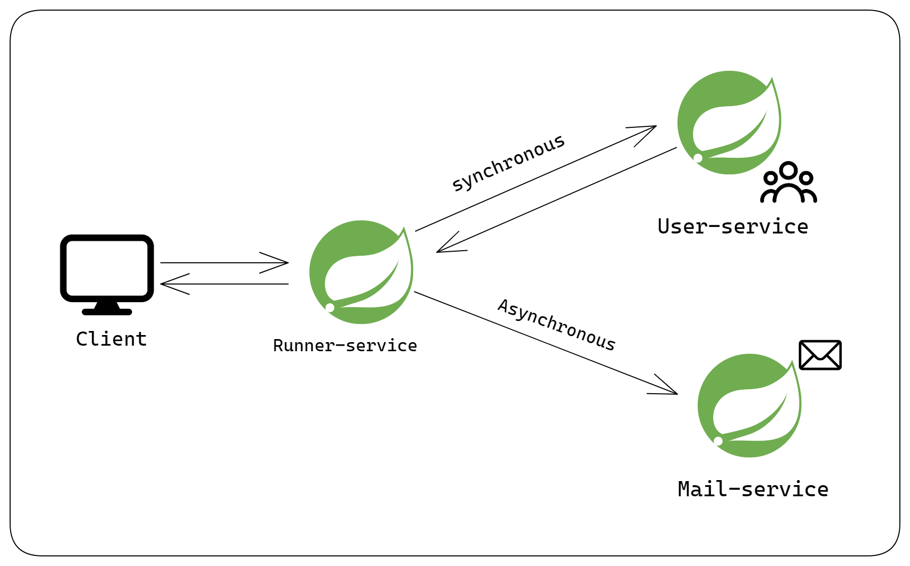

# Asynchronous Communication between microservices using @EnableAsync and @Async

## Checkout the article on <a href="https://subtle-geek.hashnode.dev/microservices-with-spring-boot-asynchronous-inter-service-communication-using-enableasync-and-async">Hashnode<a/>

