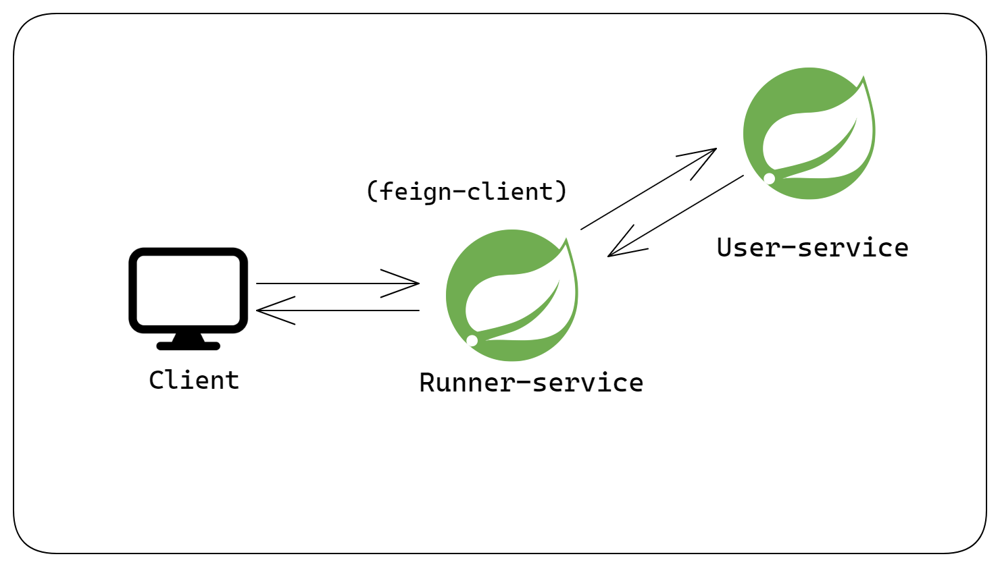

# Synchronous Communication between microservices using Feign Client

## Checkout the article on <a href="https://subtle-geek.hashnode.dev/microservices-with-spring-boot-synchronous-inter-service-communication-using-feign-client">Hashnode<a/>

