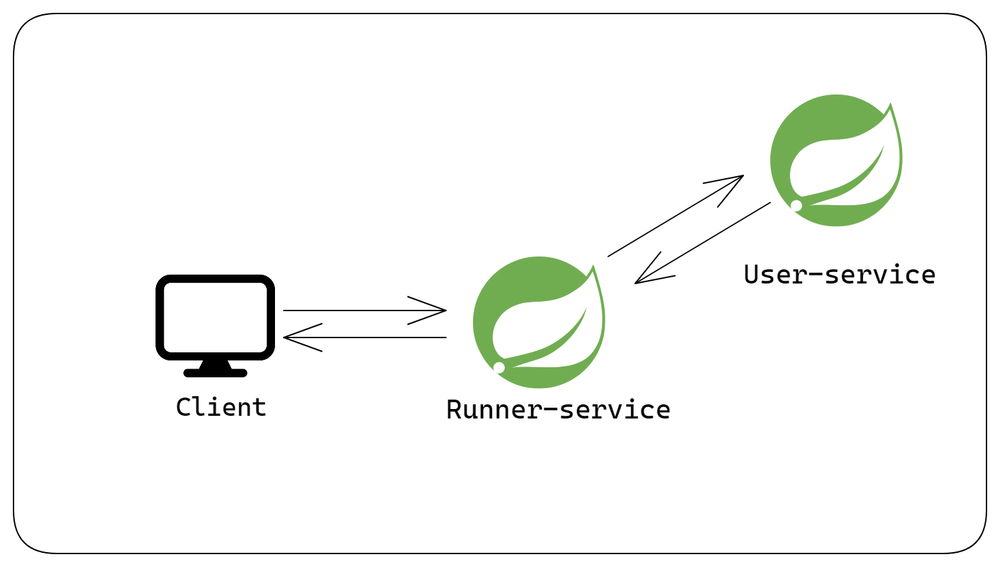

# Synchronous Communication between microservices using RestTemplate

Checkout the article on <a href="https://subtle-geek.hashnode.dev/microservices-with-spring-boot-synchronous-inter-service-communication-using-resttemplate">Hashnode<a/>